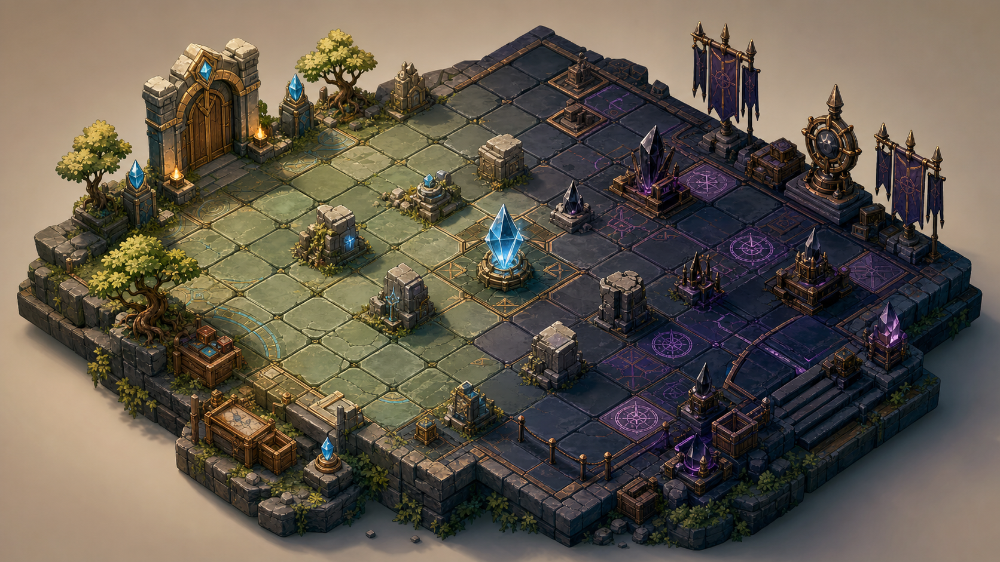

# Cervantes Tactics

Cervantes Tactics is a Godot 4 tactical RPG prototype about protecting family memory from La Orden Sin Memoria. The public version focuses on the playable Chapter I vertical slice: a hybrid 3D diorama battlefield, turn-based tactics, data-driven units, save slots, UI smoke tests, and production notes for growing the project into a maintainable open-source game.



## Current State

- Godot 4.6 project with a playable desktop prototype.
- Main menu, save slots, options dialog, and Chapter I battle scene.
- Hybrid 3D tactical diorama with camera controls, props, lighting, overlays, and ultrawide support.
- Data-driven chapter and unit resources under `data/`.
- Party units: Erick, Mitzi, Diego, and Hercules.
- Enemy units: Guardia, Arquero, and Adepto de La Orden Sin Memoria.
- Tactical actions: move, attack, magic, heal, defend, wait, limit attack, enemy turn, and win/loss conditions.
- Smoke-test scripts for menu, transition, battle UI, visual capture, and save state flows.

## Open-Source Scope

This repository is the public/open-source mirror of the working project. It intentionally excludes private production material such as pitch decks, generated exports, and internal handoff notes.

The code is open source under the MIT license. Story/canon content is public under CC BY-NC-ND 4.0. Original art/audio is protected for use only inside Cervantes Tactics. See `CONTENT_LICENSE.md` and `ASSET_LICENSES.md`.

## Requirements

- Godot 4.6 or newer.
- A desktop platform supported by Godot. The project is designed primarily for Windows desktop, but it can be opened and tested on macOS or Linux.

## Run

1. Open Godot.
2. Choose `Import`.
3. Select this repository's `project.godot`.
4. Run the project from `scenes/MainMenu.tscn`.

Command-line example:

```bash
godot --path /path/to/cervantes-tactics-godot
```

Headless import and smoke-test examples:

```bash
godot --headless --path /path/to/cervantes-tactics-godot --import
godot --headless --path /path/to/cervantes-tactics-godot --scene res://scenes/MainMenu.tscn --quit-after 5
godot --headless --path /path/to/cervantes-tactics-godot --scene res://scenes/Battle3D.tscn --quit-after 5
```

## Controls

- Click a party unit to select it.
- `Mover`: click a highlighted tile to move.
- `Atacar`: choose an enemy in range.
- `Magia`: Diego can attack enemies at range.
- `Curar`: Hercules can heal an adjacent injured ally.
- `Defender`: reduce the next incoming damage.
- `Esperar`: end the selected unit's action.
- `Terminar turno`: pass control to La Orden Sin Memoria.
- `WASD` or arrow keys: move the camera.
- `C`: recenter the camera.
- `Esc`: return to the main menu.

## Repository Layout

- `assets/`: public prototype assets and third-party CC0 assets.
- `data/`: chapter and unit resources.
- `docs/`: open-source notes, roadmap, and attribution.
- `scenes/`: Godot scenes.
- `scripts/`: gameplay, UI, save, AI, and smoke-test scripts.
- `shaders/`: visual shaders for tactical tiles and crystals.

## Roadmap

See `docs/ROADMAP.md`.

## Good First Issues

See `docs/OPEN_SOURCE_TASKS.md` for small, focused tasks that would help the project and are friendly to new contributors.

## Contributing

This is an early prototype, but focused issues, bug reports, playtest notes, and small pull requests are welcome. The healthiest contributions right now are:

- bug reports with clear reproduction steps;
- Godot 4 compatibility fixes;
- UI/readability improvements;
- tactical rules cleanup;
- tests or smoke-test improvements;
- documentation that helps new contributors run or understand the project.

## License

Code is licensed under MIT. Story/canon content is licensed under CC BY-NC-ND 4.0. Original Cervantes Tactics art, logos, portraits, standees, music, audio, and visual identity are reserved for use only inside Cervantes Tactics. Third-party assets retain their original licenses. See `CONTENT_LICENSE.md` and `ASSET_LICENSES.md`.
